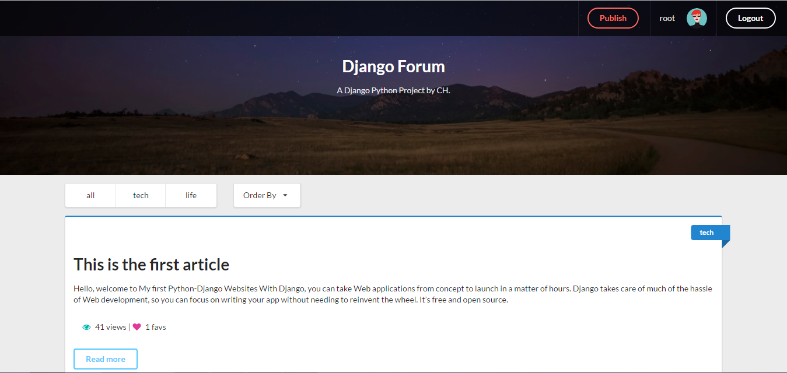
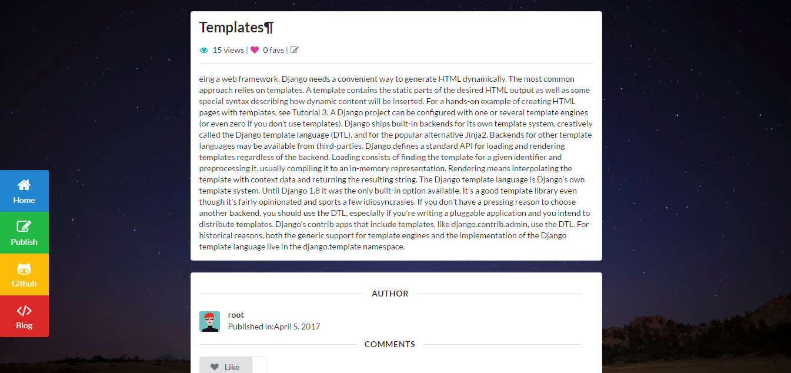
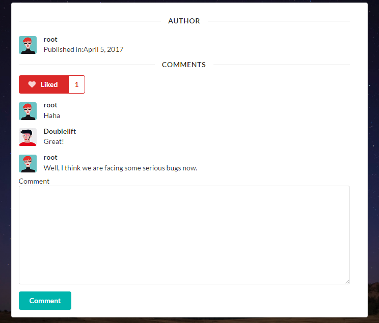
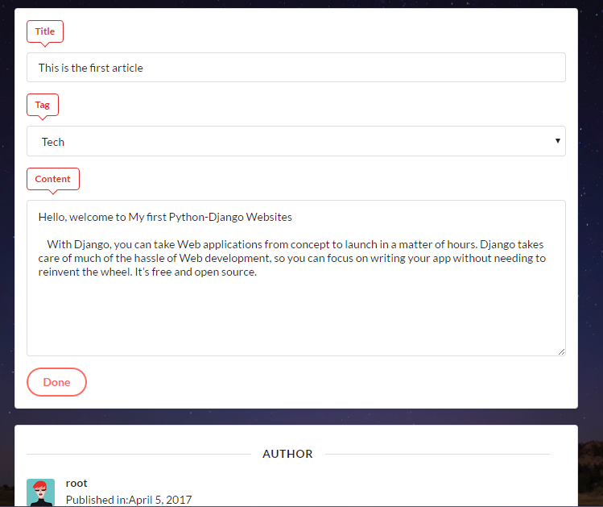

# Django-Forum
A Django Forum with SemanticUI 单纯为了测试Django的使用体验，所以舍弃了所有Js操作，部分功能的实现会轻微蛋疼 
<a href='https://www.djangoproject.com/'>PythonWeb框架:Django</a> + <a href='http://www.semantic-ui.com/'>UI框架:SemanticUI</a>
## 使用

### 安装Django

> pip install Django

### 搭建本地服务器并创建合并数据库

> python manage.py runserver 
> python manage.py makemigrations 
> python manage.py migrate 
	
### 创建网站管理员账户

> python manage.py createsuperuser
	
访问localhost/admin即可进入数据库

## Demo

这里将展示部分界面的样式 
---
主页样式

 ------
文章详情页

 ------评论

 ------再编辑修改

